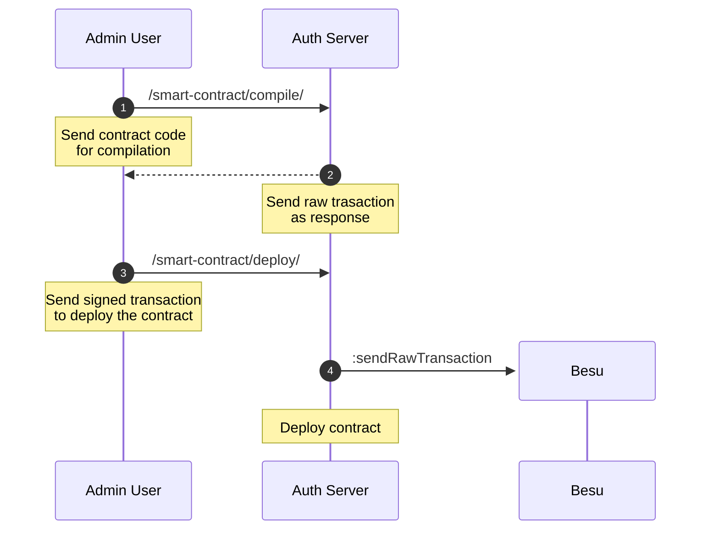

The platform provides endpoints for compiling and deploying Solidity smart contracts.

This method keeps your private key secure by signing transactions locally before sending to the API.

**Step 1: Compile Contract**
- Endpoint: `POST https://<address>/admin/api/v1/besu/compile-contract/`
- Headers: `Authorization: Bearer <token>`
- Body: form-data
	-  `contract_file` (select .sol file)
	-  `deployer_address`
	-  `constructor_params`
	-  `gas_limit`
- Response includes: ABI, bytecode, and transaction object
- If using localhost, you may exclude `admin` from the URL 


**Step 2: Sign Transaction Locally**
- Copy the `transaction` object from Step 1 response
- Open [sign_transaction.py](src/misc/sign_transaction.py)
- Paste the transaction object in the `TRANSACTION` variable
- Set your `PRIVATE_KEY
- Run: `python sign_transaction.py`
- Copy the generated signed transaction hex

**Step 3: Deploy Signed Transaction**
- Endpoint: `POST https://<address>/admin/api/v1/besu/deploy-signed/`
- Headers: `Authorization: Bearer <token>`, `Content-Type: application/json`
- Body: raw JSON
  ```json
  {
    "signed_transaction": "0x..."
  }
  ```
- Response includes: contract address, transaction hash, gas used
- If using localhost, you may exclude `admin` from the URL 


The following diagram illustrates the contract deployment flow using signed transactions:

