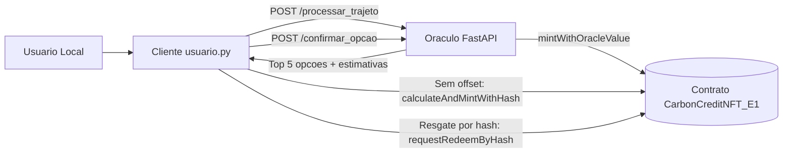
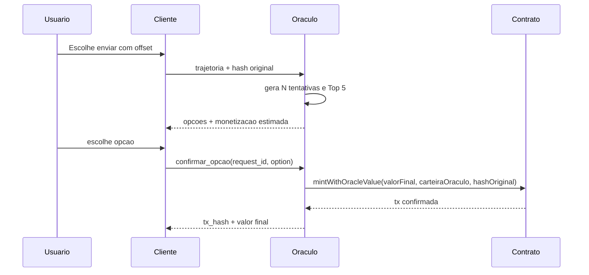
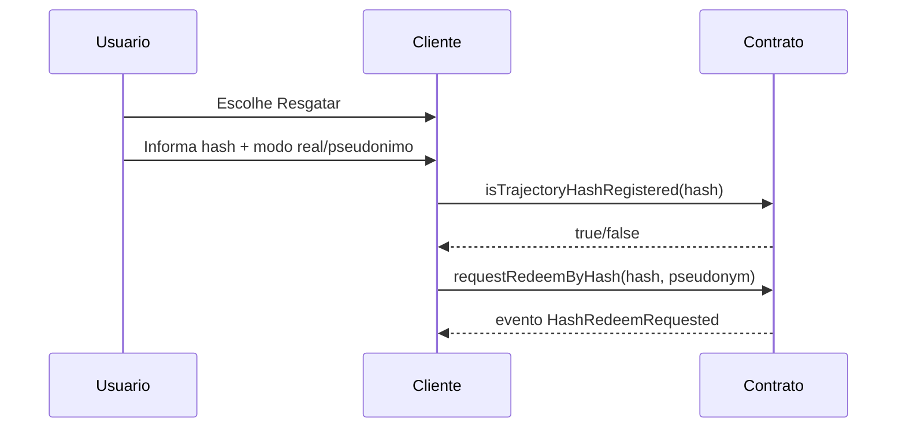

# Oracle de Privacidade por Offset - Conceito

## Objetivo

Separar privacidade de localização e monetizacao on-chain sem perder auditabilidade.

Em termos simples:

- O usuario decide se quer deslocar o trajeto (offset) ou enviar direto.
- O oraculo calcula opcoes de privacidade e monetizacao estimada.
- A blockchain registra o valor final e o hash da trajetoria original.
- O hash permite auditoria posterior sem expor o trajeto em claro.

## Ideia central

O sistema aplica o principio de minimizacao de exposicao:

- Para negociacao de privacidade, usa trajetos deslocados.
- Para vinculo auditavel, usa somente hash da trajetoria original.

Assim, o dado sensivel nao precisa ser persistido integralmente no contrato.

## Componentes e papeis

- Cliente usuario
  - Orquestra a experiencia local.
  - Pode enviar com offset, sem offset, ou solicitar resgate por hash.

- Oraculo API
  - Recebe trajeto + hash.
  - Simula N tentativas de deslocamento.
  - Retorna Top 5 por menor diferenca absoluta de distancia.
  - Aplica limite de monetizacao para nunca ultrapassar o original.

- Contrato Solidity
  - Calcula e/ou armazena valor monetizado.
  - Armazena hash original por token.
  - Mantem indice de hashes registrados para verificacao e resgate.

## Regra economica

Cada opcao deslocada passa por um teto:

- Base = 90% do valor do trajeto original.
- Bonus = ate 10% proporcional a diferenca de trajeto.
- Valor final = minimo entre valor bruto deslocado e teto.

Consequencia: o deslocado nunca supera o original.

## Diagramas Mermaid

### Arquitetura logica

### Sequencia conceitual de envio com offset

### Sequencia conceitual de resgate por hash

## Garantias e limites

- Garantias
  - Vinculo auditavel por hash original.
  - Cap de monetizacao no fluxo com offset.
  - Confirmacao explicita antes de gravar no caminho do oraculo.

- Limites atuais
  - Pendencias do oraculo ficam em memoria de processo.
  - Em restart, request_id pendente pode ser perdido.
